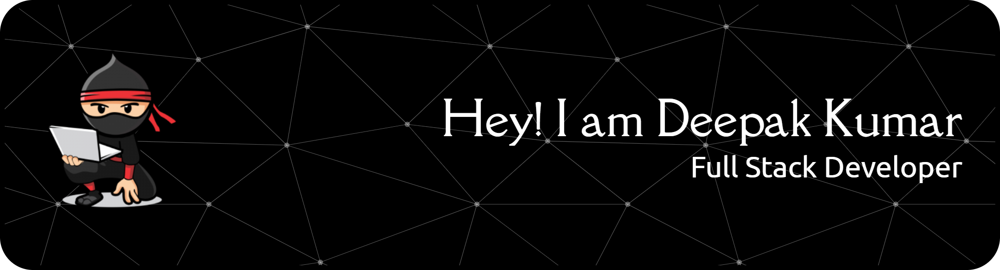

<!--Banner-->

<!--Night Owl image-->

<!--Header Name-->

  

 

  

<!--Start Intro-->

I am a Full Stack Developer with hands-on experience building responsive and scalable web applications using
React.js, Node.js, Express, MongoDB, and modern frontend practices like Redux Toolkit and RTK Query.

- ✨ Passionate about clean UI and scalable frontend architecture  
- 🌱 Currently improving my skills in advanced React patterns & backend integrations  
- 💻 Experienced in real-time features using Socket.io  
- 🚀 Focused on performance optimization and reusable component-driven development  
- ❤️ Love building real-world products and personal projects  

- 🌐 Visit my **Portfolio**: https://deepakkumar-portfolio-2n.netlify.app  
<!--End Intro-->

<!--Profile Count Badge-->

  

---

<!--Tech Stack-->
<h2 align="center">Tᴇᴄʜ sᴛᴀᴄᴋ & Lᴀᴛᴇsᴛ Wᴏʀᴋ</h2>

<picture>
  <source media="(prefers-color-scheme: dark)" srcset="./Skills_Animation_Dark.gif">
  <source media="(prefers-color-scheme: light)" srcset="./Skills_Animation_White.gif">
  
</picture>
 

<h3 align="left">Current Learning</h3>
<ul align="left">
  <li>Advanced React.js & performance optimization</li>
  <li>Backend scalability with Node.js & Express</li>
  <li>Real-time systems using Socket.io</li>
</ul>

<h3 align="left">Highlighted Projects</h3>
<ul align="left">
  <li><a href="https://ai-chat-inter-face.vercel.app/">🤖 AI Chat Interface (React + Gemini API)</a></li>
  <li><a href="https://animate-x-animation.vercel.app/">🎬 Animate-X (GSAP Animation Website)</a></li>
  <li><a href="https://tms.deepmart.shop/">🎟 Ticket Management System</a></li>
</ul>

    

---

<!--Trophies-->
<!-- <h2 align="center">🏆 Gɪᴛʜᴜʙ Tʀᴏᴘʜɪᴇs 🏆</h2>

  

 -->

---

<!--Github Stats-->
<!-- <h2 align="center">📊 Gɪᴛʜᴜʙ Sᴛᴀᴛs 📊</h2>

<table width="100%">
  <tr>
    <td width="50%">
      <h3 align="center">Gɪᴛʜᴜʙ Sᴛᴀᴛs</h3>
      
    </td>
    <td width="50%">
      <h3 align="center">Sᴛʀᴇᴀᴋ Sᴛᴀᴛs</h3>
      
    </td>
  </tr>
</table> -->

---

<!--Contribution Graph-->
<!-- <h2 align="center">📈 Cᴏɴᴛʀɪʙᴜᴛɪᴏɴ Gʀᴀᴘʜ 📈</h2>

  

 -->

<!--Contact Section-->
<h2 align="center">🤝 Cᴏɴɴᴇᴄᴛ Wɪᴛʜ Mᴇ 🤝</h2>

  

  

  

  

 

<!--Footer-->

  

